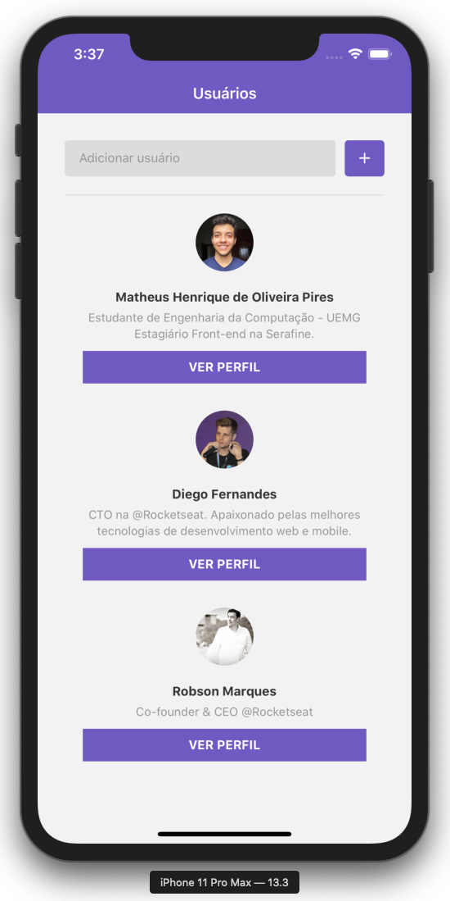
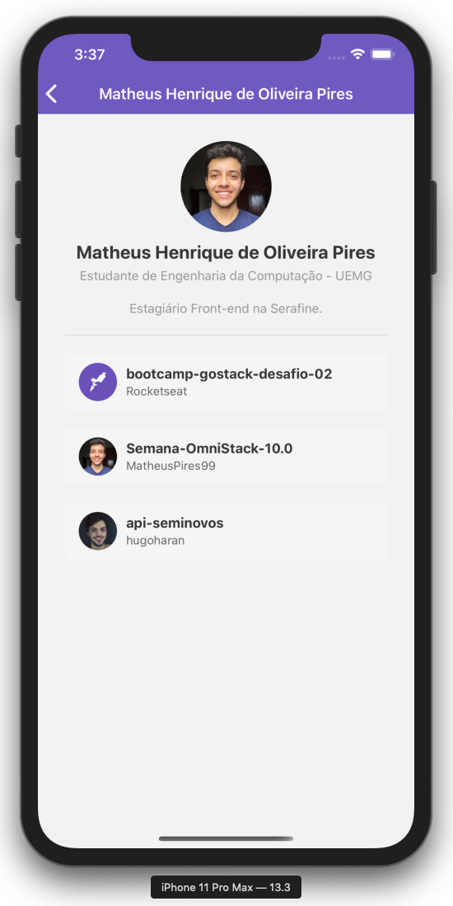
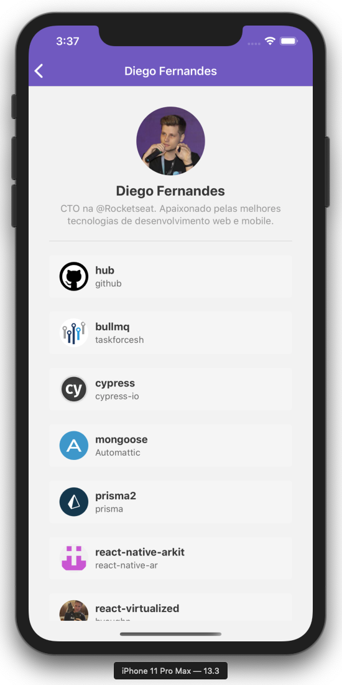
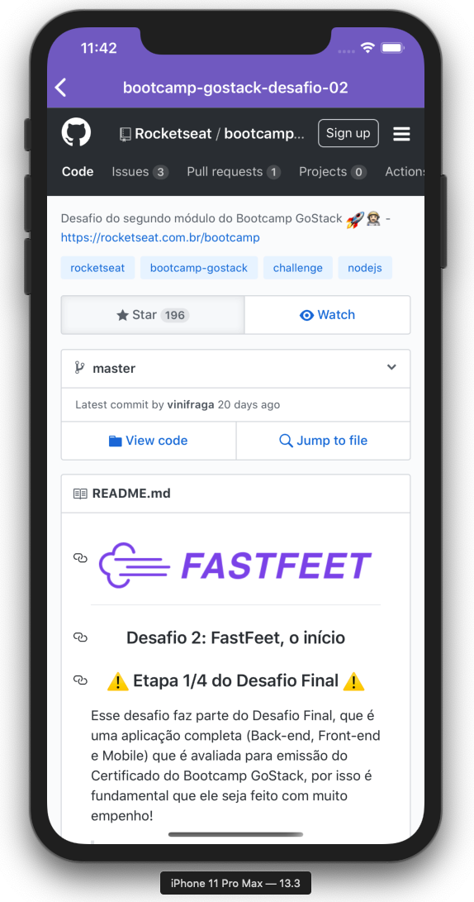

<h1 align="center">
    
</h1>

<h3 align="center">
  Módulo e Desafio 06
</h3>

## :rocket: Primeiro projeto com React Native

Nesse projetos desenvolvemos uma aplicação mobile em React Native.

Essa aplicação busca usuários do GitHub e adiciona em uma lista. Quando clicamos em um usuário entramos no seu perfil no qual podemos ver todos os repositórios que tal usuário marcou com uma estrela. 
Ao clicar no repositório abrimos uma página Web do GitHub.

## :hammer: Para criação dessa aplicação utilizamos as seguintes ferramentas:
- Criação de componentes
- Class e function components
- Styled components
- Navegação de rotas
- Estado e imutabilidade
- Propriedades
- Default Props & PropTypes

## :iphone: Resultado:

## :memo: Licença

Esse projeto está sob a licença MIT. Veja o arquivo [LICENSE](https://github.com/Rocketseat/bootcamp-gostack-desafio-06/blob/master/LICENSE.md) para mais detalhes.
