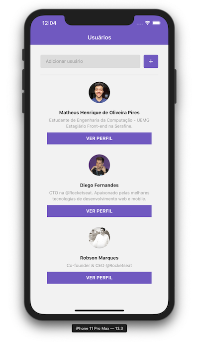
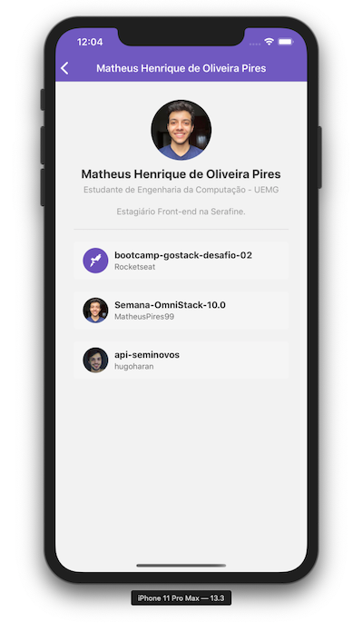
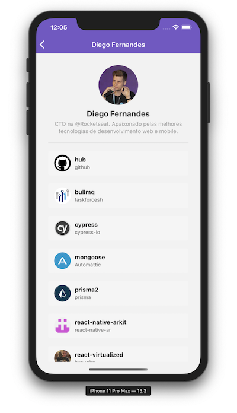
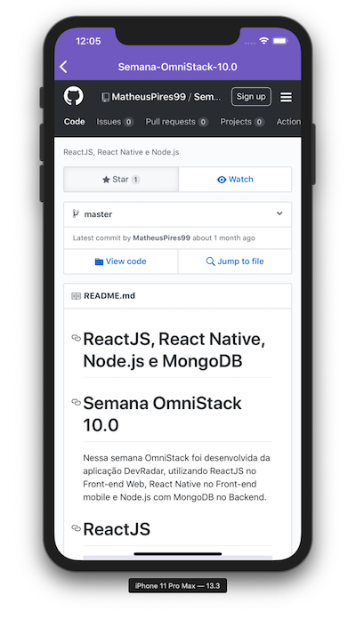

<h1 align="center">
    
</h1>

<h3 align="center">
  Módulo e Desafio 06
</h3>

## Primeiro projeto com React Native GoStack 10.0

Nesse projetos desenvolvemos uma aplicação mobile em React Native.
Essa aplicação busca usuários do GitHub e adiciona em uma lista. Quando clicamos em um usuário entramos no seu perfil no qual podemos ver todos os repositórios que tal usuário marcou com uma estrela. 
Ao clicar no repositório abrimos uma página Web do GitHub.

### Para criação dessa aplicação utilizamos as seguintes ferramentas:
- [React Navigation](https://reactnavigation.org/docs/en/getting-started.html)
- [Styled Components](https://styled-components.com/)
- [Axios](https://github.com/axios/axios)
- [Reactotron](https://github.com/infinitered/reactotron)
- [WebView](https://github.com/react-native-community/react-native-webview/blob/master/docs/Getting-Started.md)
- Default Props & PropTypes
- Local storage do celular

### Resultado

